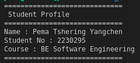
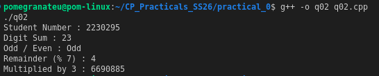
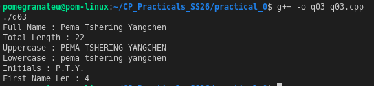
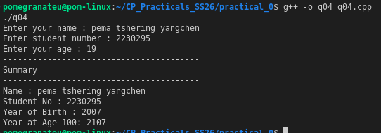
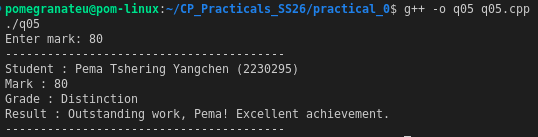
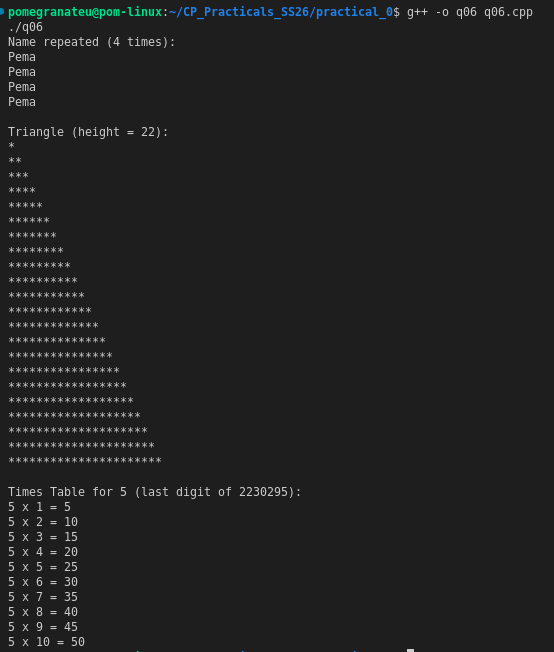
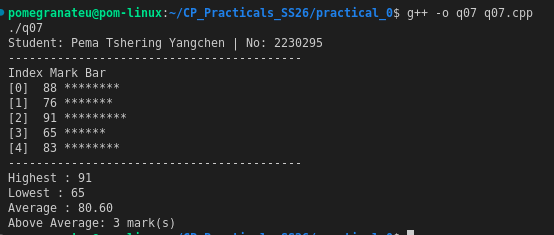
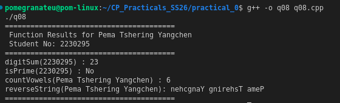
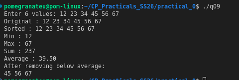
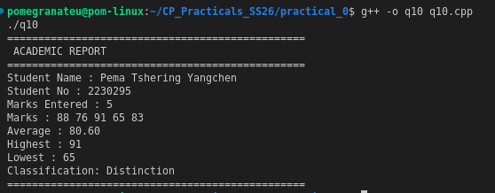

# Practical 0 - C++ Programming Fundamentals

This folder contains 10 C++ programs covering basic programming concepts and syntax.

## Files Description

| File      | Description                                                                |
| --------- | -------------------------------------------------------------------------- |
| `q01.cpp` | Personal Introduction - Variable declaration and basic output formatting   |
| `q02.cpp` | Arithmetic with Student Number - Mathematical operations and loops         |
| `q03.cpp` | String Manipulation & Analysis - String methods and character operations   |
| `q04.cpp` | Array Operations - Basic array handling and processing                     |
| `q05.cpp` | Conditional Grade Classification - If-else statements and input validation |
| `q06.cpp` | Loop Patterns - Different loop structures and pattern printing             |
| `q07.cpp` | Function Implementation - Function definition and calling                  |
| `q08.cpp` | File Operations - Basic file input/output operations                       |
| `q09.cpp` | Data Structures - Introduction to basic data structures                    |
| `q10.cpp` | Advanced Topics - Combined concepts and problem solving                    |

## Output URLs

### Program Outputs

| File      | Output URL                  |
| --------- | --------------------------- |
| `q01.cpp` |   |
| `q02.cpp` |   |
| `q03.cpp` |   |
| `q04.cpp` |   |
| `q05.cpp` |   |
| `q06.cpp` |   |
| `q07.cpp` |   |
| `q08.cpp` |   |
| `q09.cpp` |   |
| `q10.cpp` |  |

## Student Information

- **Name**: Pema Tshering Yangchen
- **Student Number**: 2230295
- **Course**: BE Software Engineering

## How to Run

### All Programs at Once

Use the provided script to run all programs:

```bash
chmod +x run_all.sh
./run_all.sh
```

## Requirements

- C++ compiler (g++)
- Linux/Unix environment
- Basic understanding of C++ syntax

## Folder Structure

```
practical_0/
├── q01.cpp - q10.cpp    # Source files
├── q01 - q10            # Compiled executables
├── outputs/             # Output files (if any)
├── run_all.sh          # Script to run all programs
└── README.md           # This file
```

## Notes

- All programs include proper comments and documentation
- Each program demonstrates specific programming concepts
- Output is formatted for easy reading and understanding
