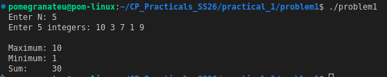

# Problem 1 — Dynamic Array Basics

## Problem Summary
Read N integers, store them in a dynamic container, then compute and display the maximum element, minimum element, and the sum of all elements.

## Algorithm Explanation
1. Read N from input.
2. Allocate a `vector<int>` of size N and read all integers into it.
3. Use STL functions `max_element`, `min_element`, and `accumulate` to compute the required values in a single pass each.

## Output

## Time Complexity
| Operation | Complexity |
|-----------|------------|
| Input     | O(N)       |
| Max/Min   | O(N)       |
| Sum       | O(N)       |
| **Total** | **O(N)**   |

## Space Complexity
O(N) — to store all N elements in the vector.

## Reflection
This problem introduced me to `std::vector` as a flexible dynamic array. I learned that STL algorithms like `max_element` and `accumulate` from `<algorithm>` and `<numeric>` make common operations concise and readable. Using iterators (`arr.begin()`, `arr.end()`) is a pattern I'll use throughout the rest of this practical.