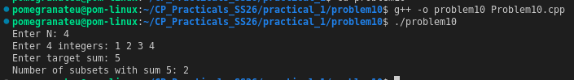

# Problem 10 — Count Subsets with Sum Equal to Target

**Reference:** [GeeksforGeeks — Count of Subsets with Sum Equal to X](https://www.geeksforgeeks.org/dsa/count-of-subsets-with-sum-equal-to-x/)

## Problem Summary
Given N integers and a target value, count how many subsets have elements that sum exactly to the target.

## Algorithm Explanation
1. Enumerate all `2^N` subsets using bitmask iteration.
2. For each `mask`, compute the subset sum by checking each bit position.
3. If `sum == target`, increment the counter.
4. Output the final count.

**Alternative — Dynamic Programming (for large N):**
Use a 1D DP array `dp[s]` = number of subsets with sum `s`. For each element, update DP in reverse to avoid using the same element twice. Time: O(N × target), Space: O(target).

## Output

## Time Complexity
| Approach           | Time Complexity   | Space Complexity |
|--------------------|-------------------|------------------|
| Bitmask (this sol) | O(N × 2^N)        | O(N)             |
| DP approach        | O(N × target)     | O(target)        |

The bitmask approach is practical for small N (≤ 20). DP is preferred for larger N.

## Space Complexity
O(N) — for the input array. O(1) extra.

## Reflection
This is a classic subset sum problem. The bitmask approach is intuitive and directly follows from Problem 8 and 9 — same enumeration, different filter. I also researched the DP approach from GeeksforGeeks, where `dp[j] += dp[j - arr[i]]` elegantly builds subset counts bottom-up. For competitive programming with large N or large target values, DP is the right tool. This problem made me see how bitmask and DP are two different lenses for the same combinatorial problem.