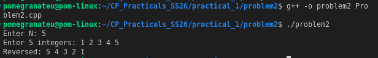

# Problem 2 — Reverse the Array

## Problem Summary
Read N integers into a vector, then print them in reverse order without modifying the original array.

## Algorithm Explanation
1. Read N integers into a `vector<int>`.
2. Traverse the vector from index N−1 down to 0, printing each element.
3. No extra memory is used — just a reverse loop.

## Output

## Time Complexity
| Operation | Complexity |
|-----------|------------|
| Input     | O(N)       |
| Traversal | O(N)       |
| **Total** | **O(N)**   |

## Space Complexity
O(N) — for the vector. O(1) extra space (no copy array needed).

## Reflection
This was a straightforward exercise but reinforced that vectors support O(1) random access via index, making reverse traversal just as fast as forward traversal. I could have also used `std::reverse()` in-place or `rbegin()/rend()` reverse iterators, but the manual loop makes the logic explicit and easy to follow.