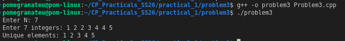

# Problem 3 — Remove Duplicates

## Problem Summary
Given N integers (possibly containing duplicates), print only the unique values in sorted order.

## Algorithm Explanation
1. Store all N integers in a `vector<int>`.
2. Sort the vector using `std::sort` — this brings duplicates adjacent to each other.
3. Use `std::unique` to move duplicates to the end, then `erase` to remove them.
4. Print the remaining elements.

## Output

## Time Complexity
| Operation    | Complexity  |
|--------------|-------------|
| Input        | O(N)        |
| Sorting      | O(N log N)  |
| `unique`     | O(N)        |
| **Total**    | **O(N log N)** |

## Space Complexity
O(N) — for the vector. `std::unique` works in-place, so O(1) extra space.

## Reflection
I learned that `std::unique` does not delete elements by itself — it only moves them and returns an iterator to the new logical end. You must follow it with `erase` to actually shrink the vector. This two-step pattern (`unique` + `erase`) is a common C++ idiom worth remembering.