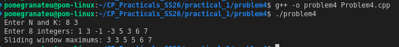

# Problem 4 — Sliding Window Maximum

## Problem Summary
Given an array of N integers and window size K, print the maximum element in every contiguous window of size K as the window slides from left to right.

## Algorithm Explanation
1. Use a `deque<int>` to store **indices** of potentially useful elements.
2. For each new element at index `i`:
   - Remove indices from the front that are outside the current window (`< i − k + 1`).
   - Remove indices from the back whose corresponding values are less than `arr[i]` (they can never be the maximum for any future window).
   - Push `i` to the back.
3. Once `i >= k − 1`, the front of the deque is the index of the current window's maximum.

## Output

## Time Complexity
| Operation       | Complexity |
|-----------------|------------|
| Each element pushed/popped at most once | O(1) amortised |
| **Total**       | **O(N)**   |

Brute force (nested loop checking every window) would be O(N × K).

## Space Complexity
O(K) — the deque holds at most K indices at any time.

## Reflection
This was the most challenging problem in the vector/deque section. My first instinct was a brute force O(N×K) solution. After understanding the deque approach, I realised the key insight: we only keep elements in the deque that could still be the maximum of some future window. Elements smaller than the newest arrival are useless and discarded immediately. This "monotonic deque" pattern appears in many competitive programming problems.