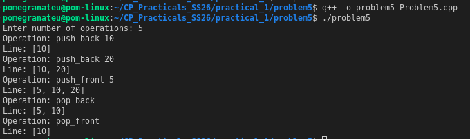

# Problem 5 — Balanced Line Problem

## Problem Summary
Simulate a queue-like line that supports insertions and deletions at both ends. After each operation, print the current contents.

## Algorithm Explanation
1. Use `std::deque<int>` which natively supports O(1) operations at both front and back.
2. Parse each operation string:
   - `push_front x` → `deque.push_front(x)`
   - `push_back x` → `deque.push_back(x)`
   - `pop_front` → `deque.pop_front()`
   - `pop_back` → `deque.pop_back()`
3. After each operation, iterate through the deque and print all elements.

## Output

## Time Complexity
| Operation           | Complexity |
|---------------------|------------|
| Each push/pop       | O(1)       |
| Print after each op | O(M) where M = current size |
| **Total**           | **O(N × M)** |

## Space Complexity
O(N) — at most N elements in the deque at any time.

## Reflection
This problem shows exactly why `deque` exists — a regular `vector` does not support O(1) insertion/deletion at the front. Implementing `push_front` on a vector would require shifting all elements, making it O(N). The deque's double-ended design makes it the perfect tool whenever you need a flexible queue or sliding window buffer.