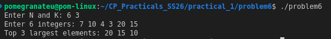

# Problem 6 — K Largest Elements

## Problem Summary
Given N numbers and an integer K, find and print the K largest numbers in descending order.

## Algorithm Explanation
1. Insert all N elements into a `priority_queue<int>` (max-heap by default in C++).
2. Call `top()` and `pop()` exactly K times — each call extracts the current maximum.
3. Print each extracted value.

## Output

## Time Complexity
| Operation         | Complexity   |
|-------------------|--------------|
| Building max-heap | O(N)         |
| K extractions     | O(K log N)   |
| **Total**         | **O(N + K log N)** |

## Space Complexity
O(N) — the heap stores all N elements.

## Reflection
`std::priority_queue` in C++ is a max-heap by default, meaning the largest element is always at the top. This makes extracting the K largest elements elegant and efficient. I also learned that you can build a min-heap using `priority_queue<int, vector<int>, greater<int>>`, which would be useful if you wanted to track the K largest using only O(K) space (maintain a min-heap of size K and push out smaller elements).