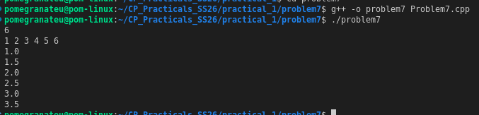

# Problem 7 — Running Median

**Source:** [HackerRank — Find the Running Median](https://www.hackerrank.com/challenges/find-the-running-median/problem)

## Problem Summary
After each number is read from a stream of N integers, compute and print the median of all numbers read so far.

## Algorithm Explanation
Maintain two heaps that partition the data into two halves:
- **`lowerHalf`** — a max-heap holding the smaller half of elements.
- **`upperHalf`** — a min-heap holding the larger half of elements.

For each new element:
1. Insert into `lowerHalf` if it's ≤ current max of lower half, else into `upperHalf`.
2. **Rebalance:** ensure `|lowerHalf.size() − upperHalf.size()| ≤ 1` by transferring the top element between heaps.
3. **Median:**
   - If sizes are equal → median = average of both tops.
   - If `lowerHalf` is larger → median = `lowerHalf.top()`.

## Output

## Time Complexity
| Operation          | Complexity   |
|--------------------|--------------|
| Each insertion     | O(log N)     |
| Each rebalance     | O(log N)     |
| **Total for N elements** | **O(N log N)** |

## Space Complexity
O(N) — both heaps together hold all N elements.

## Reflection
This is a classic two-heap problem. Before this, I would have sorted the array each time to find the median — O(N² log N) overall. The dual-heap approach keeps one heap's top as the "boundary" between halves, giving the median in O(1) after O(log N) insertion. The rebalancing step is the trickiest part: you must always ensure the heaps differ in size by at most 1.