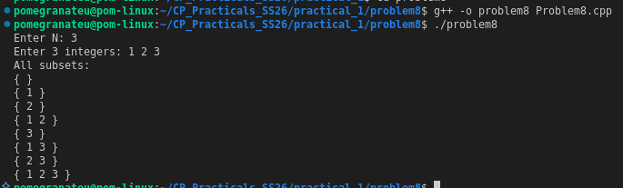

# Problem 8 — Subset Generation

## Problem Summary
Given a set of N numbers, generate and print all 2^N possible subsets including the empty set.

## Algorithm Explanation
1. For N elements, there are `1 << N` (i.e., 2^N) possible subsets.
2. Iterate `mask` from `0` to `2^N − 1`.
3. For each `mask`, iterate through all bit positions `i` from `0` to `N−1`.
   - If bit `i` is set in `mask` (i.e., `mask & (1 << i)` is non-zero), include `arr[i]` in the current subset.
4. Print each subset.

The binary representation of `mask` directly encodes which elements are included: bit `i` = 1 means element `i` is in the subset.

## Output

## Time Complexity
| Operation              | Complexity     |
|------------------------|----------------|
| Outer loop (all masks) | O(2^N)         |
| Inner loop (per mask)  | O(N)           |
| **Total**              | **O(N × 2^N)** |

## Space Complexity
O(1) extra — subsets are printed directly without storing them. Input array is O(N).

## Reflection
Bitmask enumeration is elegant because it maps every integer from 0 to 2^N−1 directly to a unique subset. Each bit in the mask represents whether an element is "in" or "out". This technique works well for N ≤ 20 (about 1 million subsets). For larger N, dynamic programming approaches are needed. I also noticed the subset order matches the binary counting order: `{}`, `{1}`, `{2}`, `{1,2}`, `{3}`, ... which is a nice property.