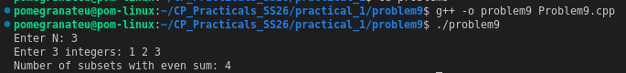

# Problem 9 — Count Subsets with Even Sum

## Problem Summary
Given N numbers, count how many of the 2^N subsets (including the empty set) have an even sum.

## Algorithm Explanation
1. Enumerate all `2^N` subsets using bitmask iteration (same as Problem 8).
2. For each `mask`, compute the sum of elements whose corresponding bits are set.
3. If the sum is divisible by 2 (i.e., `sum % 2 == 0`), increment the counter.
4. Print the total count.

**Mathematical note:** For any array with at least one element, exactly 2^(N−1) subsets have an even sum. The empty set (sum = 0) always counts.

## Output

## Time Complexity
| Operation              | Complexity     |
|------------------------|----------------|
| Outer loop (all masks) | O(2^N)         |
| Sum computation        | O(N)           |
| **Total**              | **O(N × 2^N)** |

## Space Complexity
O(N) — for the input array. O(1) extra space.

## Reflection
This extends Problem 8 by adding a filter condition (even sum). The bitmask approach made it easy — I just added a sum accumulator inside the inner loop and checked parity. I also noticed the mathematical pattern: the answer is always 2^(N−1) when N ≥ 1, which can be computed in O(1). But the bitmask approach is more general and can be adapted to other sum conditions easily.