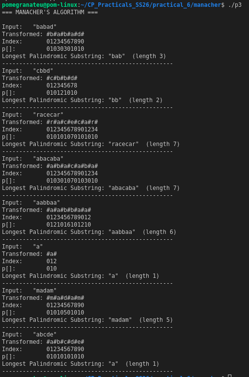

# P3 — Manacher's Algorithm

## Overview

**Manacher's Algorithm** finds the **longest palindromic substring** of a string in **O(n) time** — far better than the O(n²) naive expand-around-centre approach. It works by maintaining a "mirror" window of the rightmost palindrome found so far and reusing previously computed palindrome radii to skip redundant comparisons.

---

## Key Idea

### Step 1 — Transform the string

Insert `#` separators between every character (and at both ends) so that both odd- and even-length palindromes are handled uniformly:

```
"abba"  →  "#a#b#b#a#"
"aba"   →  "#a#b#a#"
```

Every palindrome in the transformed string has odd length and a well-defined centre.

### Step 2 — Fill the radius array `p[]`

`p[i]` = radius of the palindrome centred at position `i` in the transformed string.

For each new centre `i`, use the **mirror** of `i` around the current rightmost palindrome's centre `c`:

```
mirror = 2*c - i
```

If `i` is within the right boundary `r`, we know `p[i] >= min(r - i, p[mirror])` — so we start expanding from there instead of from 0.

### Step 3 — Extract result

The longest palindrome in the original string has length `maxP[i]` and starts at `(maxCentre - maxLen) / 2`.

---

## Complexity

| Metric | Value |
|--------|-------|
| Time   | O(n)  |
| Space  | O(n)  |

Each character is visited at most twice (once during the window scan, once during expansion that extends the right boundary).

---

## Sample Output



---

## Compile & Run

```bash
g++ -o p3 manacher.cpp
./p3
```

---

## Reflection

**What I implemented:**  
Manacher's algorithm with the `#`-separator transformation, the mirroring optimisation using `centre` and `right` boundary tracking, and a diagnostic `printTable` function that shows the transformed string and full `p[]` array for each test case.

**Key insight:**  
The mirror property is the heart of the algorithm. When we know a large palindrome spans `[l, r]`, any centre `i` inside it has a mirror `mirror = 2*centre - i` on the left side. The palindrome radius at `i` is at least `min(r - i, p[mirror])` — so we skip that many expansions for free.

**Why O(n)?**  
The right boundary `r` only ever moves rightward. Every time we expand, `r` increases. Since `r` can increase at most `n` times total, the total number of expansion steps across all centres is O(n).

**Difference from naive approach:**  
Naive expand-around-centre is O(n²) in the worst case (e.g., "aaaaaaa"). Manacher's handles this in O(n) because each character that was already "covered" by a prior palindrome window is never re-expanded.

**Challenges:**  
Understanding when to trust the mirror value fully vs. when to keep expanding. The condition `p[i] = min(r - i, p[mirror])` handles this: if `p[mirror] < r - i`, the palindrome fits entirely within the window (use it directly); if `p[mirror] >= r - i`, the palindrome touches or exceeds the boundary (we must expand further to find the true radius).

**What I would improve:**  
Extending the output to list *all* palindromic substrings of maximum length (there may be ties), and adding a version that returns all palindromes above a given minimum length.