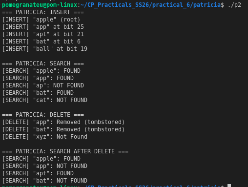

# P2 — PATRICIA Trie (Insert, Search, Delete)

## Overview

**PATRICIA** (Practical Algorithm to Retrieve Information Coded in Alphanumeric) is a space-efficient version of binary tries. Instead of having one node for each character, one node contains a bit index associated with the bit position in the key which identifies the direction traversed from the current node (left for 0, right for 1). Each node will point upward back to another node indicate the ending of a search; these back edges will enable PATRICIA to differentiate itself from ordinary commercial tries.

---

## Operations Implemented

| Operation | Time Complexity | Description |
|-----------|----------------|-------------|
| Insert    | O(m)           | Walk trie by bit index; find first differing bit vs. existing key; splice new node in |
| Search    | O(m)           | Follow bit-indexed branches until a back-edge; compare stored key |
| Delete    | O(m)           | Tombstone approach — key overwritten with empty string |

*m* = key length in bits.

---

## How It Works

Keys will be considered **bit strings**. Each node will contain one integer `bitIndex` that indicates what bit should be evaluated at this point in the structure. A node with a child node with lower bitIndex than itself pointing to it is a back edge; there are no additional *leaf* nodes in the PATRICIA structure compared to a typical binary trie.

```
Insert "apple", "app", "apt", "bat", "ball"

root (bitIndex = -1, key = "apple")
 └─ left back-edge initially to root itself

After all inserts, branching happens at the first bit
position where two keys differ, e.g. 'a' vs 'b' at bit 6.
```

**Search:** Walk forward while `curr->bitIndex > prev->bitIndex`. When a back-edge is detected, compare the key stored in that node against the query.

**Delete (tombstone):** Full structural removal in PATRICIA requires careful pointer surgery (finding both the "internal" node that branches on the key's bit AND the "terminal" back-edge node). The tombstone approach used here marks deleted keys with an empty string, which is standard in educational implementations.

---

## Sample Output



---

## Compile & Run

```bash
g++ -o p2 patricia.cpp
./p2
```

---

## Reflection

**What I implemented:**  
A bit string based PATRICIA trie that uses a computed bit index to branch. A call to the `getBit` function will determine the k-th bit of a character string as follows: (1) The byte index is determined by `find Byte Location` and then (2) The k-th bit is determined by the bit offset in the byte `find Bit Offset`. The function `firstDifferentBit` determines where a new key is inserted.

**Key insight:**  
PATRICIA's efficient use of nodes is due to its back-edge function; rather than having null-terminated leaves for the key, each node can be either a branching point (providing the additional functionality of terminating) or a representation of the key itself. As such, a trie will contain the same number of nodes as there are keys regardless of their lengths (all will contain exactly n keys), while a standard trie will contain a number of nodes equal to the total number of characters represented by all the keys.

**Difference from standard Trie:**  

A standard trie stores one node per character; PATRICIA stores one node per key. For long, similar keys this is a dramatic memory saving.

**Challenges:**  
To insert into a given index into the tree, one must carefully order the inserts. This dictates where the new nodes will fall in the Binary Tree Index Sequence (BTIS) and how to connect their respective forward and backward edges correctly. Deleting an entire branch (as opposed to creating a tombstone for the whole branch) will require maintaining both the internal node of the branch and a terminal back-edge of the branch, which results in considerable additional complexity in terms of pointers.

**What I would improve:**  
Implementing true structural deletion, and adding a `collectAll` traversal that properly handles the back-edge termination condition for printing all stored keys.