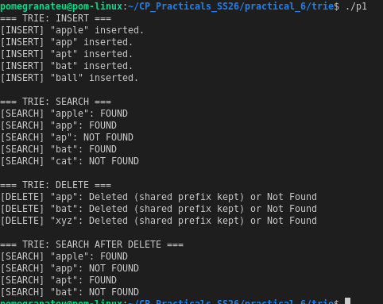

# P1 — Basic Trie (Insert, Search, Delete)

## Overview

A **Trie** (prefix tree) is a tree-like data structure in which every character corresponds to one node in that tree structure. Words are created by connecting together each character in sequence, starting from the root node and ending at either a leaf node or another node designated as the end of a word. When used for prefix-based searches or auto-completing words, Tries are highly efficient.

---

## Operations Implemented

| Operation | Time Complexity | Description |
|-----------|----------------|-------------|
| Insert    | O(m)           | Traverse/create nodes for each character in word of length *m* |
| Search    | O(m)           | Follow characters; return true only if last node is end-of-word |
| Delete    | O(m)           | Unmark end-of-word; recursively prune dangling nodes |

Space: O(ALPHABET_SIZE × N × M) worst case, where N = number of words, M = average length.

---

## How It Works

```
Insert "apple", "app", "apt", "bat", "ball":

root
├── a
│   └── p
│       ├── p [end] ← "app"
│       │   └── l
│       │       └── e [end] ← "apple"
│       └── t [end] ← "apt"
└── b
    ├── a
    │   └── t [end] ← "bat"
    └── a
        └── l
            └── l [end] ← "ball"
```

**Delete "app":** unmarks end-of-word at `p`. The node is kept because `apple` still branches from it.  
**Delete "bat":** unmarks end-of-word; the `t` node has no children → pruned back up.

---

## Sample Output


---

## Compile & Run

```bash
g++ -o p1 trie.cpp
./p1
```

---

## Reflection

**What I implemented:**  
A typical implementation of a Trie means that a child can be held in a `unordered_map`, which allows you to have a Trie using any set of characters (even without the need for an array of fixed-size alphabets). When calling the delete method, you will traverse the Trie with a recursive algorithm to prune nodes that do not have any children left, nor previously served as end-of-word markers themselves.

**Key insight:**  
Recursive deletion handles the "shared prefix" problem, which means deleting `"app"` cannot destroy the path to `"apple"`. Recursive deletion returns a `bool` indicating whether the child node can be deleted. Therefore, it will only prune branches that are actually disconnected from the parent directory.

**Challenges:**  
When deleting items from the structure, correctly managing memory is crucial. In order to prevent memory leaks I created a helper method called `deleteNode` in the destructor along with a recursive helper method `deleteHelper` to check if a node has been deleted and therefore cannot be used for further additions.

**What I would improve:**  
To support autocomplete, I will add a `startsWith(prefix)` method. Additionally, I plan to replace the implementation of `unordered_map` with an array of arbitrary size (e.g., `children[26]` array) for pure lowercase-alpha input, which is expected to improve cache performance significantly.